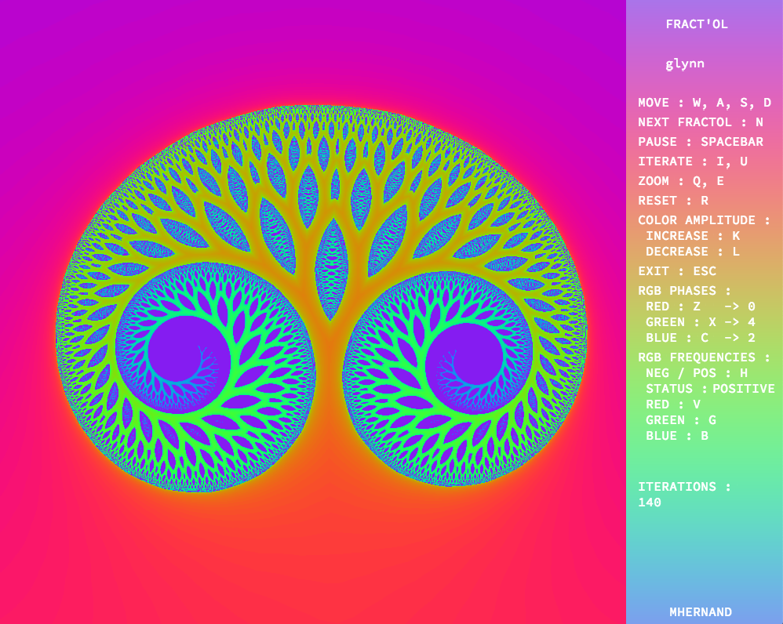
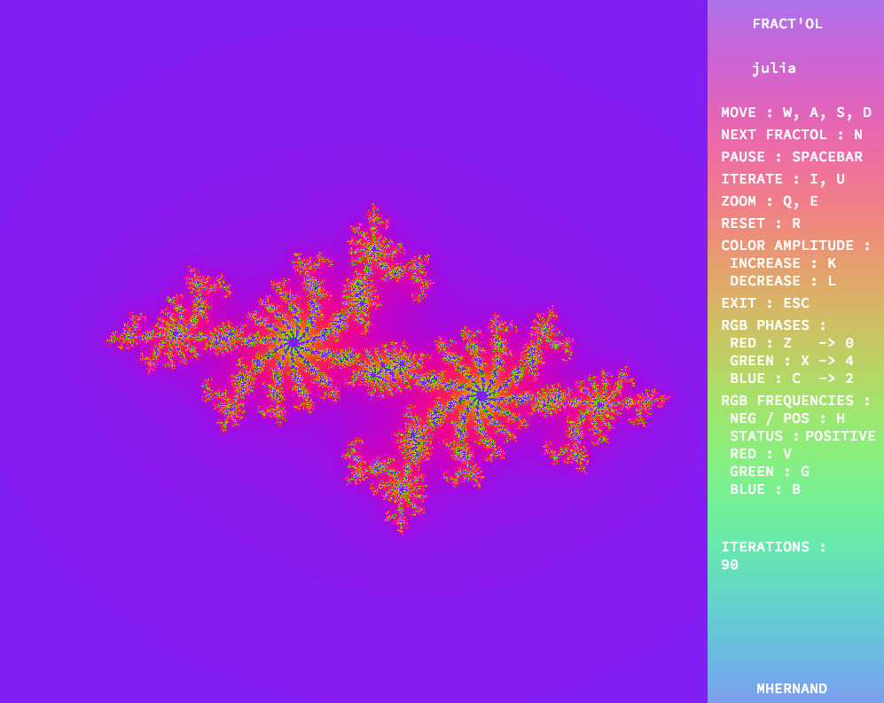
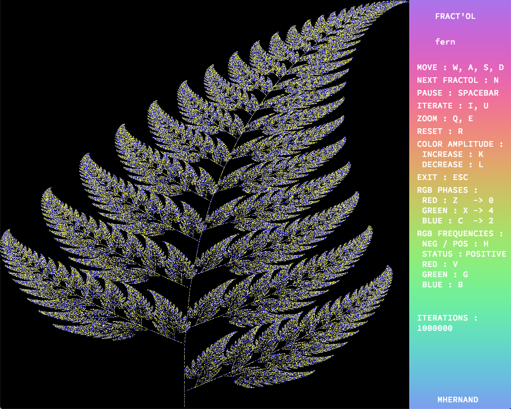

# FRACT-OL

This project is meant to create graphically beautiful fractals. 

## INSTALLATION
Run make inside the repo.
```
$ make path/to/repo
```

## LUNCHING PROGRAM
The program takes a fractal name as the input. The options are `julia`, `mandelbrot`, `glynn`, `fern`, `koch`, `burning`, `tricorn`, `sierpinski`, `doubleburning`.
```
$ ./fractol name_of_fractal
```

## FEATURES
- Nine possible fractals to choose from
- Live switching between fractals
- Zoom in/out with mouse scrolling
- Modify color amplitude and frequencies
- Move fractal
- Increase/decrease iterations
- Color gradient
- Mouse hover effect (julia fractal)

An example of a the gylnn fractal with 140 iterations and zoom.
# 

An example of a the julia fractal with 90 iterations and mouse-hover over specific area.
# 

The fern fractal at 10,000,000 iteration.
# 
